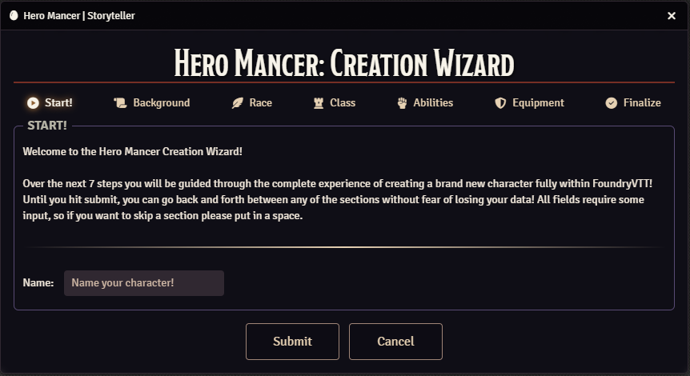
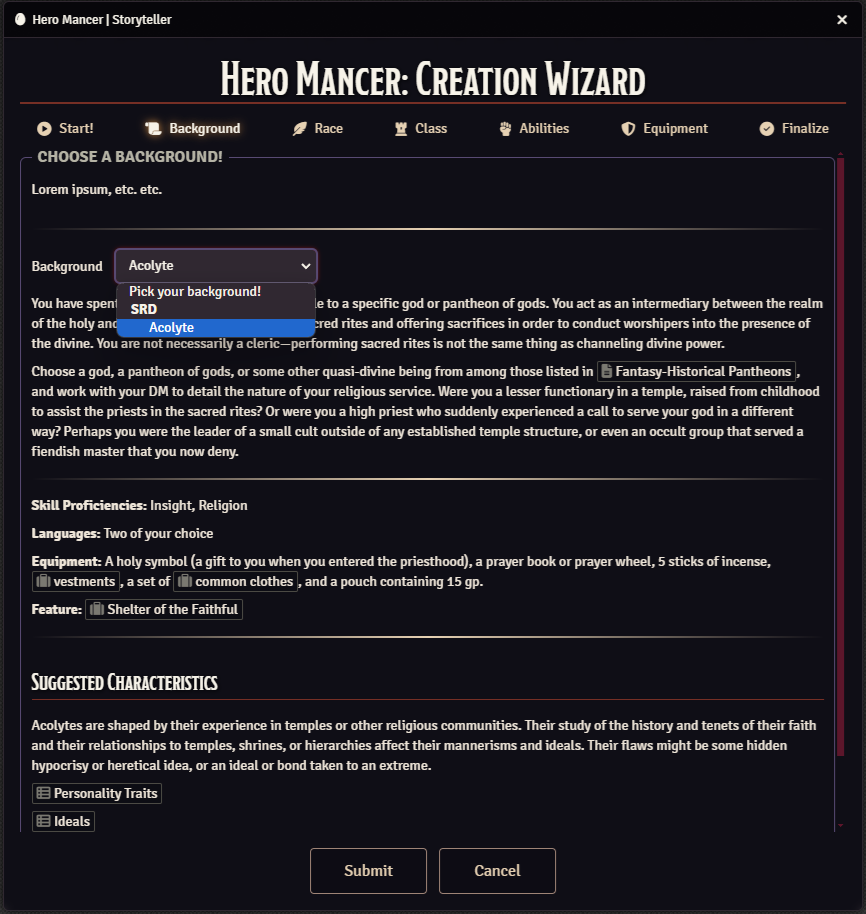
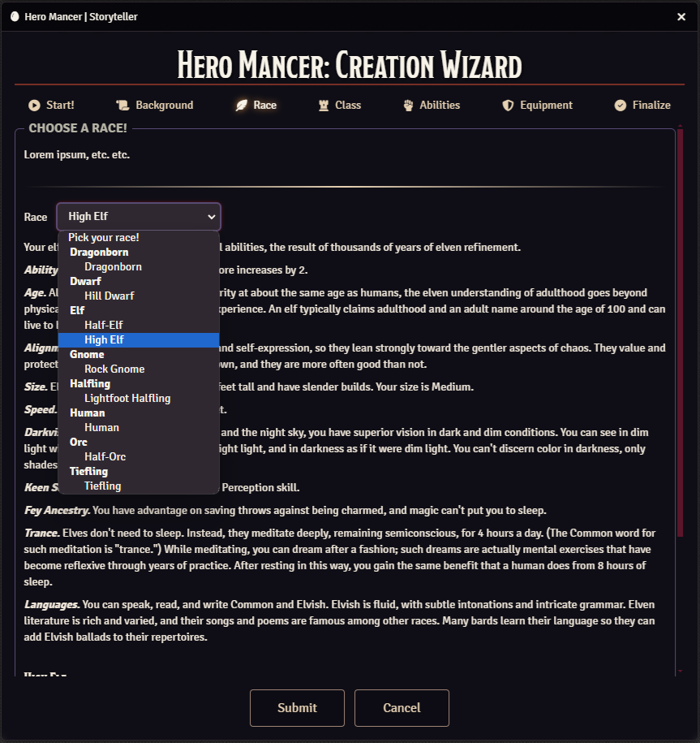
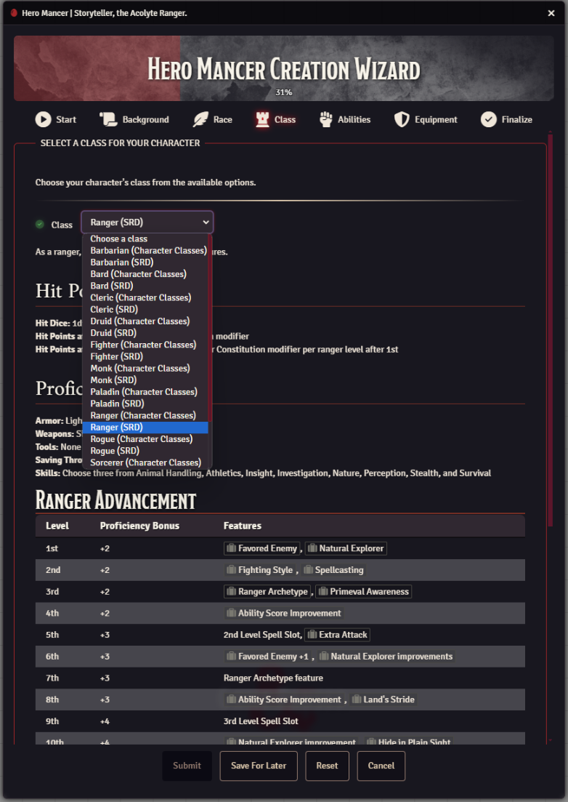
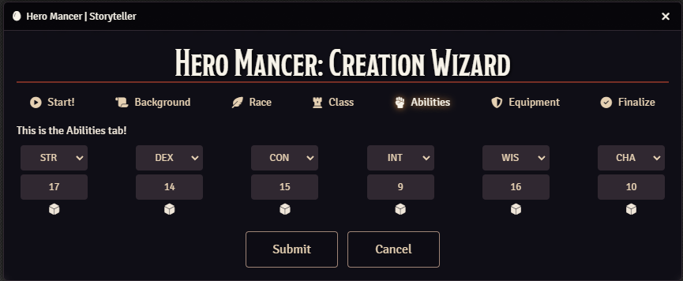
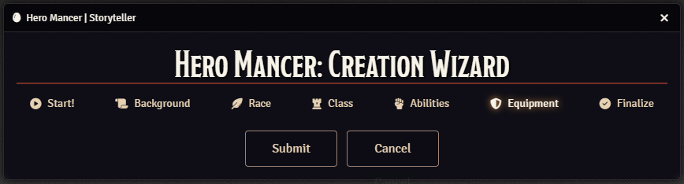
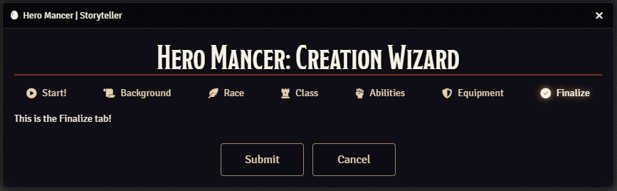

# Hero Mancer

## Supporting The Module

## Introduction

**Hero Mancer** is the ultimate companion for character creation in FoundryVTT, offering everything you need to build your heroes effortlessly and with style!
Whether you're a player building from scratch or a GM guiding character advancement, Hero Mancer's sleek UI and dynamic integration make it a breeze. It covers
every aspect of character creation!

Stop struggling with hard-to-search compendiums and manual processes! **Hero Mancer** automates it all in one seamless experience.

---

## Features

Hero Mancer has been crafted with powerful features to give your character creation process a boost:

- **Compendium Magic**: No more searching through endless lists—Hero Mancer automatically pulls races, classes, backgrounds, and more from compendiums-you can
  even specify your own!
- **Smooth Navigation**: Dynamic dropdowns organize options by folders and packs, making it easy to select the perfect combination of traits for your character.
- **Enriched Descriptions**: Get detailed, formatted descriptions at your fingertips, thanks to automatic HTML enrichment for all the choices you make.
- **Stat Rolling**: Roll your dice with ease- and assign your rolls to your ability scores!

---

## Installation

The easiest way to get started with Hero Mancer is through Foundry’s **Module Manager** or **The Forge's Bazaar**. But if you prefer to do it yourself, we’ve
got you covered.

### Manual Installation

1. Open **Foundry's Configuration and Setup** screen, go to **Add-on Modules**.
2. Click the **Install Module** button.
3. In the **Manifest URL** field, enter the following URL to install the latest version:  
   [https://github.com/Sayshal/hero-mancer/releases/latest/download/module.json](https://github.com/Sayshal/hero-mancer/releases/latest/download/module.json)
4. Click **Install** and watch Hero Mancer come to life!
5. Once installed, enable Hero Mancer by going to **Manage Modules**.

---

## Tour

Take a look at how Hero Mancer elevates your character creation process! These screenshots show the module in action.

### 1. Getting Start

The beginning of your hero’s journey! This tab gives an overview of the steps you'll follow to create your character.

  
_The starting tab showing an overview of the character creation steps._

### 2. Choose a Background

Choose your character’s background from a dropdown, with enriched descriptions that help immerse you in your role.

  
_The background selection dropdown with enriched descriptions._

### 3. Choose a Race

Organized dropdowns make it easy to browse races based on custom or default compendiums.

  
_The race selection dropdown showing folder and race options._

### 4. Choose a Class

Quickly select your class from organized compendiums. Hero Mancer handles the heavy lifting for you!

  
_The class selection dropdown with classes grouped by pack._

### 5. Choose Abilities

No need to roll dice manually—Hero Mancer’s built-in stat roller handles it for you, keeping things fast and efficient.

  
_The abilities tab with stat fields and roll icons._

### 6. Choose Starting Equipment

Outfit your character with all the necessary gear using the Equipment tab. Choose items from detailed dropdowns.

  
_The equipment tab for selecting and managing your character’s gear._

### 7. Final Check

Review your selections and lock in your hero, ready for the adventure that lies ahead.

  
_The finalization tab for reviewing and completing the character creation process._

---

## Why Hero Mancer?

Hero Mancer isn’t just a module—it’s your character creation powerhouse! With its automated processes, enriched descriptions, and built-in tools, it turns the
often tedious task of character creation into a smooth, exciting part of your adventure. So what are you waiting for? Let Hero Mancer take your characters to
the next level!

---
